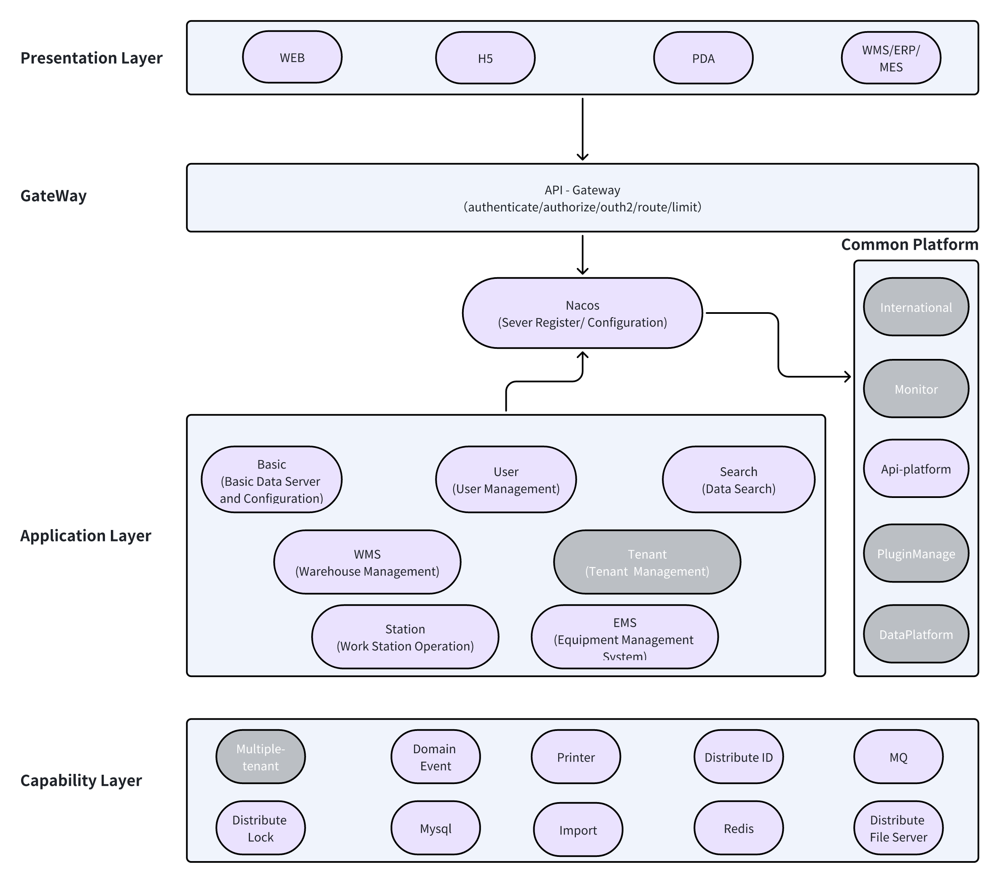

# オープン倉庫実行システム (Open WES)

[English](README.md) | [中文](README_CN.md) | [日本語](README_JP.md)

**Open WES** は、倉庫業務を効率化するために設計されたカスタマイズ可能なオープンソースの倉庫実行システムです。さまざまな自動化技術とシームレスに統合され、効率的なワークフロー管理、タスクスケジューリング、リアルタイムデータ追跡を提供します。

## 機能

- **タスク管理**: 倉庫業務全体のタスクを効率的に管理し、優先順位を付けます。
- **リアルタイム監視**: 在庫、設備、ワークフローのライブビューを取得します。
- **モジュラーデザイン**: 既存の倉庫システムと簡単に統合できます。
- **カスタマイズ可能なルール**: タスクの割り当て、仕分け、ルーティングのルールを設定します。
- **オープンAPI**: RESTfulまたはWebSocket APIを使用してシステムと対話します。

## インストール

### 前提条件

- [Java](https://www.java.com/) (17+): バックエンドサーバーアプリケーションを実行するため。
- [MySQL](https://www.mysql.com/) (8.0+): 倉庫データを保存するためのリレーショナルデータベースとして使用。
- [Nacos](https://nacos.io/) (2.0+): サービスレジストリおよび構成管理ツール。
- [Redis](https://redis.io/) (7.0+): キャッシュおよびセッション管理に使用。
- [Node.js](https://nodejs.org/)(18+): クライアントアプリケーションを実行するため。

> MySQL、Nacos、およびRedisは同じマシンにインストールする必要があります。
> server/docker/docker-composeを使用して、MySQL、Nacos、およびRedisなどのすべてのミドルウェアをインストールできます。

### 手順

**リポジトリをクローン:**
   ```bash
   git clone https://github.com/jingsewu/open-wes.git
   cd open-wes
   HOST_IP=$(hostname -I | awk '{print $1}') docker-compose up -d
   ```

#### サーバーの実行

1. server/scriptフォルダ内のスクリプトを実行してNacos構成を追加します。
```bash
mysql -u root -p nacos_config < server/script/nacos_config.sql
```
2. ホスト名`nacos.openwes.com`を設定するために、ホストファイルを編集します（例：Linuxの場合は`/etc/hosts`、Windowsの場合は`C:\Windows\System32\drivers\etc\hosts`）。
   ```172.0.0.1 nacos.openwes.com```
3. データベースopenwesを作成します。
  ```sql
    create database openwes;
  ```
4. /serverディレクトリにあるWesApplication、GatewayApplication、およびStationApplicationを起動します。

#### クライアントの実行
1. [webpack.config.example.dev.js](client/build/webpack.config.example.dev.js)をwebpack.config.dev.jsに更新します。
```bash
mv client/build/webpack.config.example.dev.js client/build/webpack.config.dev.js
```
2. クライアントを起動します：cd clientと実行します：
  ```bash
  npm install
  npm start
  ```

## 使用方法

Open WESは、倉庫を管理するためのユーザーフレンドリーなインターフェースを提供します。以下のタスクを実行できます：

- **新製品の追加**: 新製品を在庫に簡単に追加し、新しいアイテムの導入プロセスを簡素化します。

- **在庫レベルの管理**: 在庫レベルを簡単に監視および管理し、最適な在庫の可用性を確保し、過剰在庫や在庫不足を防ぎます。

- **完全な倉庫フローのサポート**: Open WESは、入庫プロセス（受け取り）、出庫プロセス（出荷）、再確認、梱包、棚卸し、在庫移動を含む完全な倉庫ワークフローをサポートします。この包括的なサポートにより、効率的で組織化された操作が保証されます。

- **パフォーマンスレポートの生成**: 倉庫のパフォーマンスに関する詳細なレポートにアクセスし、在庫回転率、注文完了率、運用効率などの主要指標に関する貴重な洞察を提供します。

- **オペレーターおよびロボット操作のサポート**: Open WESは、人間とロボットの操作の両方をシームレスにサポートし、柔軟で効率的な作業環境を促進します。倉庫スタッフは自動化システムと効果的に協力し、生産性を最適化できます。

- **WCSおよびRCSとの簡単な統合**: Open WESは、倉庫制御システム（WCS）およびロボット制御システム（RCS）との簡単な統合を目的としています。このスムーズな接続により、倉庫環境内のロボットシステムの同期および効率的な管理が可能になります。

詳細な手順と例については、[ウェブサイト](https://www.openwes.top/)を参照してください。

## 貢献

このプロジェクトの改善に役立つコミュニティからの貢献を歓迎します。貢献するには：

1. リポジトリをフォークします。
2. 機能またはバグ修正のための新しいブランチを作成します。
3. 変更を加えてコミットします。
4. 変更内容と解決する問題を詳述したプルリクエストを送信します。

詳細については、[貢献ガイドライン](CONTRIBUTING.md)を参照してください。

## ライセンス

このプロジェクトは[MITライセンス](LICENSE)の下でライセンスされています。

## 連絡先

質問がある場合や支援が必要な場合は、[GitHub Issues](https://github.com/jingsewu/open-wes/issues)ページでお気軽にお問い合わせください。

Smart Warehouse Management Systemの使用および貢献に感謝します！

## アーキテクチャ
Open WESのアーキテクチャはモジュラーでスケーラブルであり、複雑な倉庫操作に対応するように設計されています。以下はそのコンポーネントの概要です：



## ヘルプの取得

問題が発生した場合や質問がある場合は、以下のリソースを確認してください：
- [GitHub Issues](https://github.com/jingsewu/open-wes/issues): バグを報告したり、機能をリクエストしたりします。
- [ドキュメント](./doc): 詳細なガイドやAPIドキュメントを見つけます。
